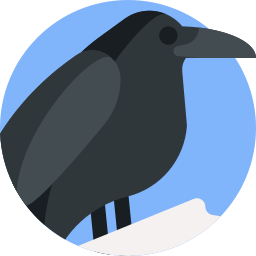
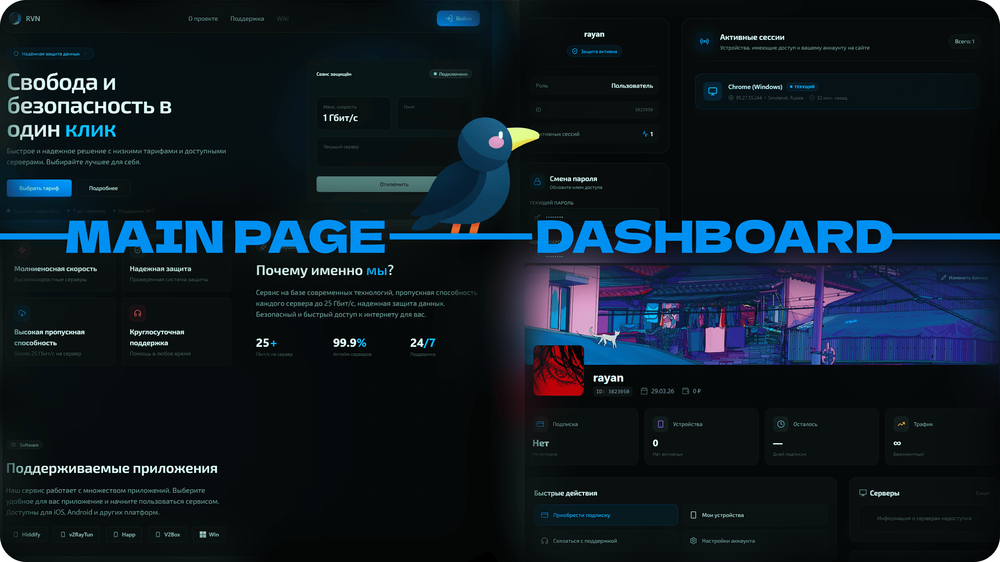

<h1 align="center">
  
  rvncom/website
</h1>

<p align="center">
  
</p>

<p align="center">
  
  
  
  
  
  
  
  
  
  
  
  
  
  
  
</p>

## 📖 About

**RVN** is a VPN service that gives users fast, private internet access without the usual setup hassle. Pick a plan, top up your balance or redeem a promo, and your connection is ready in seconds — no manual configuration, no waiting around.

The site is the home base for everything around the subscription: account and device management, payments and balance history, in-app support with live replies, and notifications that keep you in the loop. Sign in with the provider you already use, manage your plan from any device, and reach support whenever something needs attention.

## 🚀 Tech Stack

**Core**: Vinext - Next.js API on Vite 8, React 19, TypeScript, Tailwind CSS, Radix UI

**API**: tRPC 11, Socket.io

**Data**: Drizzle ORM (PostgreSQL), Redis, AWS S3

**Auth**: Argon2id, OAuth (Google, GitHub, Yandex, Telegram, VK, Twitch)

**Infra** Docker, Rust → WASM (Image processing), Rolldown

## 📚 Documentation

[**Vinext notes**](docs/vinext/vinext.en.md) — workarounds for the regressions still present as of vinext 0.0.55 (ambient `next/*` declarations, vitest aliases, cookie `sameSite` casing, `next/image` prop gaps).

### Authentication

| Document | Description |
|----------|-------------|
| [Authentication architecture](docs/auth/architecture.en.md) | Sessions, device tokens, OAuth, password hashing, cookies |
| [OAuth providers](docs/auth/oauth.en.md) | Google / Yandex / Twitch / VK / Telegram / GitHub-admin flows, CSRF state, popup vs full-page, account linking |
| [Sessions & Cookies](docs/auth/sessions.en.md) | `token` / `session_id` / `user_data` cookies, token binding, refresh flow, logout, session store |
| [Device fingerprinting](docs/auth/device-fingerprint.en.md) | Two-layer FPID system, IndexedDB, server-side hashing, deduplication |
| [Device IP geolocation](docs/auth/geolocation.en.md) | MaxMind GeoLite2, ip-api.com fallback, caching, storage format |

### Notifications

| Document | Description |
|----------|-------------|
| [Notification system](docs/notifications/notifications.en.md) | Real-time notifications, UPSERT grouping, WebSocket delivery, caching |
| [Notification types](docs/notifications/types.en.md) | Type catalog, UPSERT semantics, cleanup policy, read paths, system broadcasts |

### WebSocket

| Document | Description |
|----------|-------------|
| [WebSocket architecture](docs/websocket/architecture.en.md) | Connection, rooms, broadcast, authentication |
| [Event Directory](docs/websocket/events.en.md) | Client/server events, error codes, REST endpoints |
| [Reconnection & resilience](docs/websocket/reconnection.en.md) | Socket.IO retry strategy, debounce, token rotation, room rejoin, broadcast model |

### Security

| Document | Description |
|----------|-------------|
| [Bot Protection](docs/security/protection.en.md) | Proxy middleware, suspicion detector, rate limiting, CSRF, security headers |
| [Security Headers & CSP](docs/security/headers.en.md) | CSP directives, HSTS, CORS, static-file handling, origin validation |
| [Role-Based Access Control](docs/security/rbac.en.md) | `user` / `support` / `admin` roles, tRPC middleware, `pex` cookie flag, cache invalidation |

### Storage, Media

| Document | Description |
|----------|-------------|
| [Storage & Media](docs/storage/storage.en.md) | S3-compatible upload, Redis media cache (gzip + TTL), WASM (Rust) Image Processor |
| [Upload pipeline](docs/storage/upload.en.md) | Magic-byte validation, per-route specifics (avatar/banner/support), thumbhash, cache warm-up |

### Subscriptions, Payments

| Document | Description |
|----------|-------------|
| [Subscriptions & Payments](docs/subscriptions/subscriptions.en.md) | Plan catalogue, Remnawave provisioning, balance/promo/external purchase flows, payment webhook |
| [Balance & Promo](docs/subscriptions/balance.en.md) | `users.balance`, `payments`, `balance_transactions` ledger, test promo, top-up & purchase flows |

### Database

| Document | Description |
|----------|-------------|
| [Migrations](docs/database/migrations.en.md) | Drizzle Kit workflow, custom migrations for triggers/CHECK constraints, `db:generate` / `db:migrate` scripts, bootstrap on existing DBs |

### Development

| Document | Description |
|----------|-------------|
| [Local dev stack](docs/dev/local-stack.en.md) | One-command local Postgres + Redis + MinIO + WS server, generated secrets, auto migrations, `dev/up.mjs` / `dev/down.mjs` |

---

## ⚙️ Setup

```bash
cp .env.example .env
pnpm install
pnpm run build:wasm
pnpm run build
pnpm run dev
```

### Local dev stack

Don't have a Postgres / Redis / S3 / WS server to point at? Spin up a complete local environment (containers + generated secrets + auto migrations) with one command, then run the dev server:

```bash
node dev/up.mjs     # Postgres + Redis + MinIO + WS server
pnpm dev            # rvn-web on http://localhost:3000
node dev/down.mjs   # tear it down
```

See [Local dev stack](docs/dev/local-stack.en.md) for ports, OAuth/Turnstile notes, and the `.env.local` backup behaviour.

## 📜 Scripts

```
pnpm dev               # dev server
pnpm build             # production build
pnpm start             # production server
pnpm test              # vitest
pnpm lint              # oxlint
pnpm format            # prettier
pnpm db:generate       # drizzle-kit: emit a new SQL migration from schema.ts
pnpm db:migrate        # apply pending migrations to DATABASE_URL
pnpm db:studio         # drizzle-kit studio (local DB inspector)
```

## 🐳 Docker

The image is built in stages (WASM → deps → build → runner) and outputs a standalone server on port `3001`.

**Build** — two public build args are baked into the client bundle, and the MaxMind license key is passed as a BuildKit secret (never written to an image layer):

```bash
export MAXMIND_LICENSE_KEY=your-license-key

docker build \
  --build-arg NEXT_PUBLIC_WS_URL=wss://ws.rvn.market \
  --build-arg NEXT_PUBLIC_TURNSTILE_SITEKEY=your-sitekey \
  --secret id=maxmind_key,env=MAXMIND_LICENSE_KEY \
  -t rvn-web .
```

| Build variable | How | Required | Purpose |
|----------------|-----|----------|---------|
| `NEXT_PUBLIC_WS_URL` | `--build-arg` | yes | WebSocket URL, inlined into the client bundle |
| `NEXT_PUBLIC_TURNSTILE_SITEKEY` | `--build-arg` | yes | Turnstile site key, inlined into the client bundle |
| `MAXMIND_LICENSE_KEY` | `--secret id=maxmind_key` | no | Official GeoLite2 download; omit to fall back to a mirror |

**Run** — runtime config comes from the environment (see [Environment](#-environment)):

```bash
docker run -p 3001:3001 --env-file .env rvn-web
```

## 📁 Project Structure

```
app/
├── auth/              # login, register, OAuth
├── dashboard/         # user dashboard
├── admin/             # admin panel
├── support/           # ticket system
├── user/settings/     # profile settings
├── api/               # tRPC, websocket, uploads
└── protection/        # bot/DDoS protection

lib/
├── auth/              # sessions, device fingerprint
├── database/          # drizzle, redis, cache
├── storage/           # S3, media cache
├── trpc/              # routers (auth, user, admin)
└── websocket/         # socket.io server

wasm/                  # Rust image processing
```

## 🌐 Environment

`.env.example`:

- `NEXT_PUBLIC_DOMAIN` — app URL
- `DATABASE_URL` — PostgreSQL connection
- `REDIS_URL` — cache
- `S3_*` — object storage
- `CSRF_SECRET` / `TURNSTILE_*` — security
- OAuth keys per provider

## License

The project is distributed under the License Terms: [Apache License 2.0 + Commons Clause](./LICENSE.md)

---
