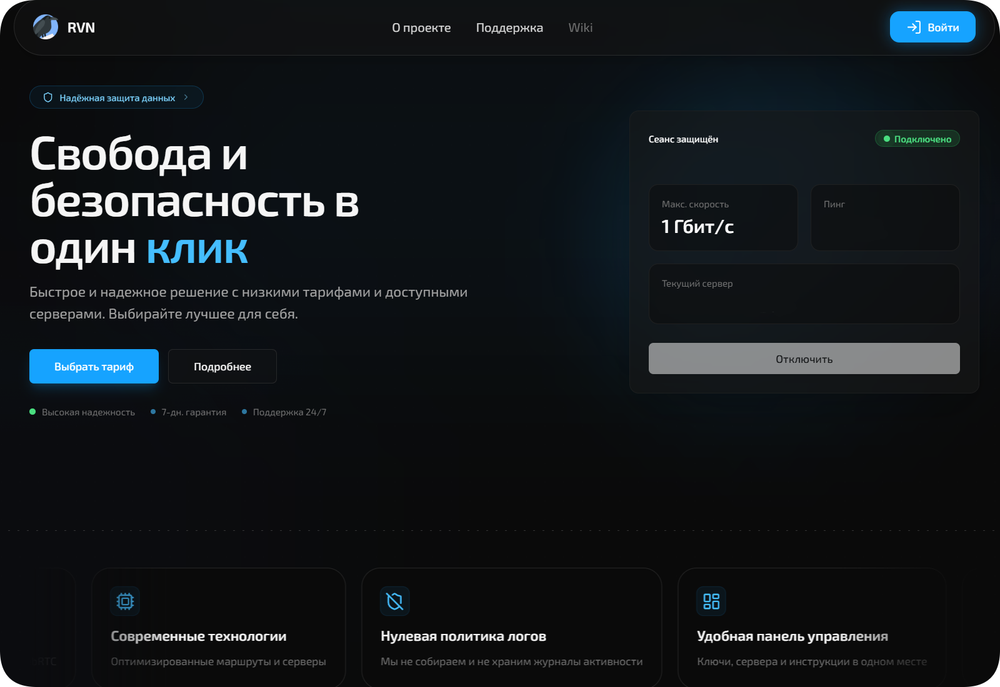

<div align="center">
  <h1 align="center">Raven Private</h1>

  <a href="https://rvn.market">
    
  </a>

  <p align="center">
    Powerful protection by RVN. Secure, high‑performance VPN & Proxy (VLESS) for a clean internet without limits.
  </p>

  <p align="center">
    <a href="https://rvn.market">
      
    </a>
  </p>
</div>

## Tech Stack

**Core** — Next.js 16, React 19, TypeScript, Tailwind CSS, Radix UI

**API** — tRPC 11, Socket.io

**Data** — Supabase (PostgreSQL), Redis, AWS S3

**Auth** — bcrypt, OAuth (Google, GitHub, Yandex, Telegram, VK, Twitch)

**Infra** — Docker, Rust → WASM (image processing), Turbopack

---

## Setup

```bash
cp .env.example .env
pnpm install
pnpm run build:wasm
pnpm run build
pnpm dev
```

## Scripts

```bash
pnpm dev               # dev server
pnpm build             # production build
pnpm start             # production server
pnpm test              # vitest
pnpm lint              # oxlint
pnpm format            # prettier
```

## Project Structure

```
app/
├── auth/              # login, register, OAuth
├── dashboard/         # user dashboard
├── admin/             # admin panel
├── support/           # ticket system
├── user/settings/     # profile settings
├── api/               # tRPC, websocket, uploads
└── protection/        # bot/DDoS protection

lib/
├── auth/              # sessions, device fingerprint
├── database/          # supabase, redis, cache
├── storage/           # S3, media cache
├── trpc/              # routers (auth, user, admin)
└── websocket/         # socket.io server

wasm/                  # Rust image processing
```

## Environment

`.env.example`:

- `NEXT_PUBLIC_DOMAIN` — app URL
- `SUPABASE_*` — database
- `REDIS_URL` — cache
- `S3_*` — object storage
- `CSRF_SECRET` / `TURNSTILE_*` — security
- OAuth keys per provider

---
